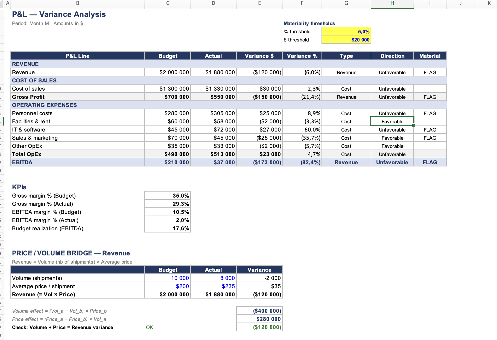
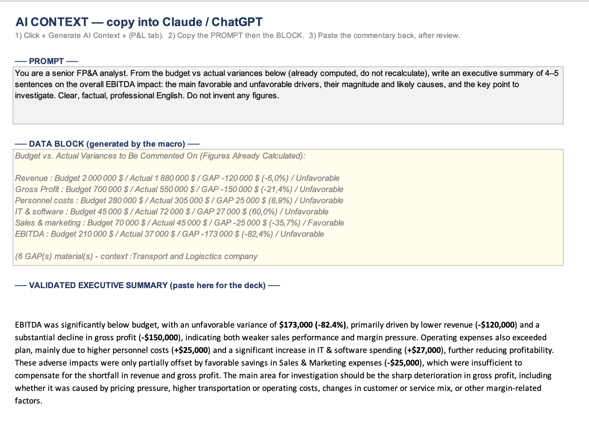
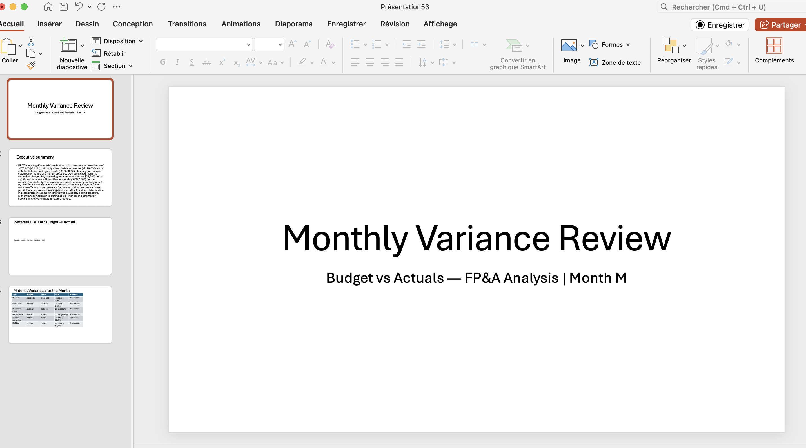

# FP&A AI Automation Tool
### Monthly Variance Analysis — Automated with Claude AI & Excel VBA

> Built by **Romain Gageot** — FP&A Analyst | Toronto, Canada  
> 📧 romaingageot.pro@gmail.com | 🔗 [LinkedIn](https://www.linkedin.com/in/romaingageot)

---

## What it does

This tool automates the monthly FP&A variance analysis workflow — a process that typically takes **3 hours** now runs in **~15 minutes**.

You enter the actuals. The tool does the rest.

---

## How it works — Step by step

**Step 1 — P&L Variance Analysis**
- Input your Budget and Actual figures across all P&L lines
- The tool automatically calculates Variance ($) and Variance (%)
- Material variances are flagged based on configurable thresholds (% and $)
- KPIs are computed instantly: Gross Margin, EBITDA Margin, Budget Realization

**Step 2 — Price / Volume Bridge**
- Revenue variance is decomposed into **Volume Effect** and **Price Effect**
- Provides a clear root cause analysis of revenue performance

**Step 3 — EBITDA Waterfall**
- Visual waterfall chart generated automatically
- Shows the bridge from Budget EBITDA to Actual EBITDA
- Each variance driver is displayed with its favorable / unfavorable direction

**Step 4 — AI Commentary (Claude AI)**
- One click generates the AI Context block
- The macro formats all material variances into a structured prompt
- Paste into Claude or ChatGPT — get a professional executive summary in seconds
- The analyst reviews, validates, and pastes the commentary into the deck

**Step 5 — Board-Ready PowerPoint Deck**
- A Monthly Variance Review deck is auto-populated
- Includes: Title slide, Executive Summary, Waterfall chart, Material Variances table
- Ready to send to leadership after validation

---

## Screenshots

### P&L Variance Analysis with KPIs and Price/Volume Bridge

### AI Context Generator

### Board-Ready PowerPoint Output

---

## Tech Stack

| Tool | Usage |
|------|-------|
| **Excel VBA** | Automation, macro engine, data formatting |
| **Claude AI / ChatGPT** | Executive summary and variance commentary generation |
| **PowerPoint (via VBA)** | Auto-populated board deck |
| **Excel Charts** | EBITDA waterfall visualization |

---

## Key Features

- Configurable materiality thresholds (% and $)
- Automatic favorable / unfavorable flagging
- Price-Volume decomposition of revenue variance
- AI-ready prompt generation — no manual formatting
- Board-ready PowerPoint output with one click
- Fully editable and adaptable to any company's P&L structure

---

## Why I built this

I am a junior FP&A professional who recently relocated from France to Toronto. I built this tool to demonstrate what modern FP&A looks like when you combine financial expertise with AI — turning a 3-hour manual process into a 15-minute automated workflow.

This project reflects my belief that the future of FP&A is not about replacing analysts, but about freeing them to focus on decisions rather than data processing.

---

## About me

**Romain Gageot** — French-Canadian FP&A Analyst based in Toronto  
1 year of FP&A experience at DACHSER France (Europe's largest transport company) — managing monthly reporting across 40 agencies (~25M€ revenue scope)  
Bilingual French-English | Pursuing CPA Canada | Available immediately

📧 romaingageot.pro@gmail.com  
🔗 [LinkedIn](https://www.linkedin.com/in/romaingageot)
